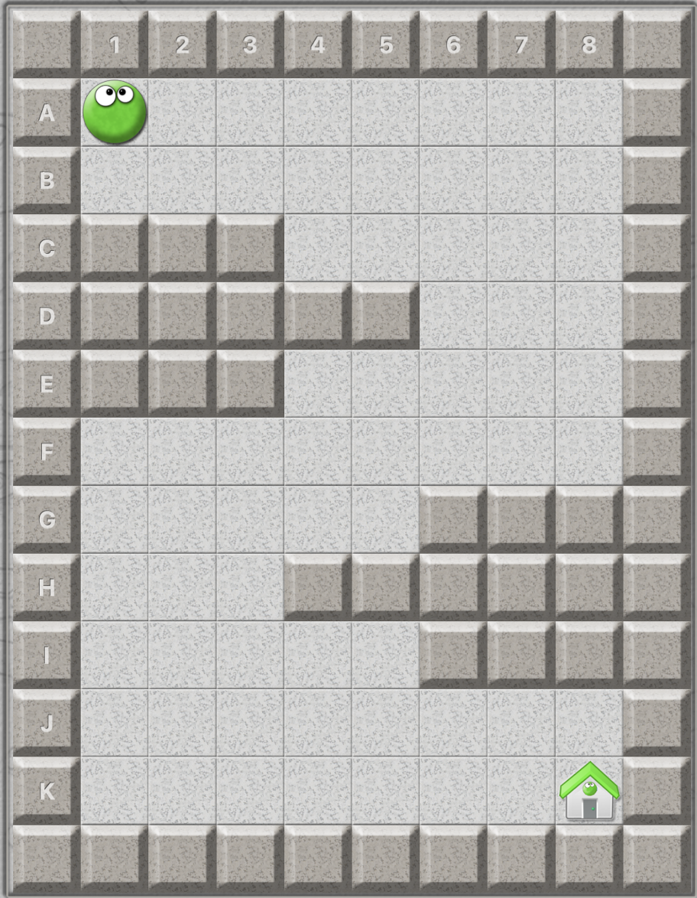
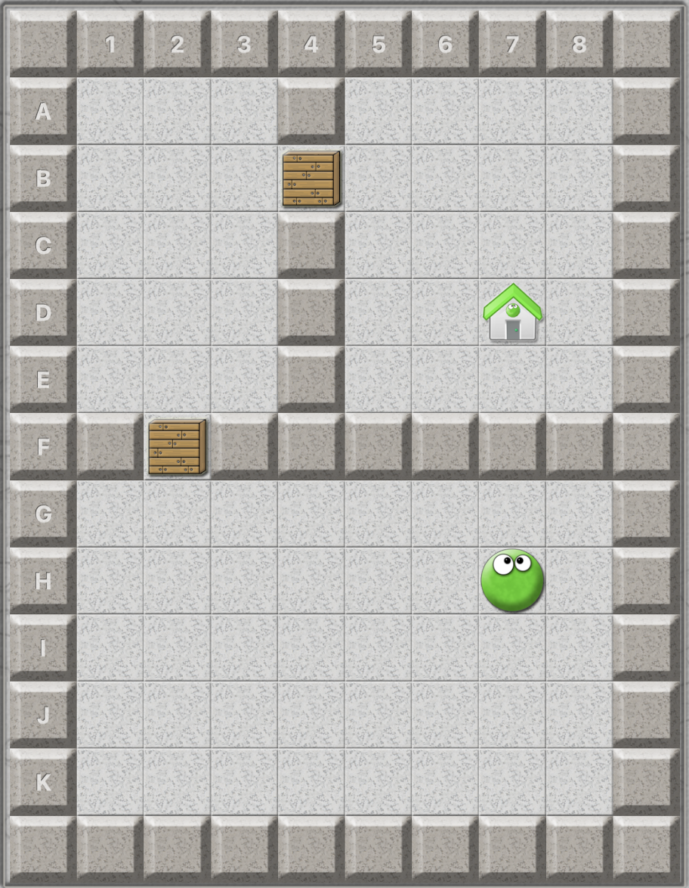
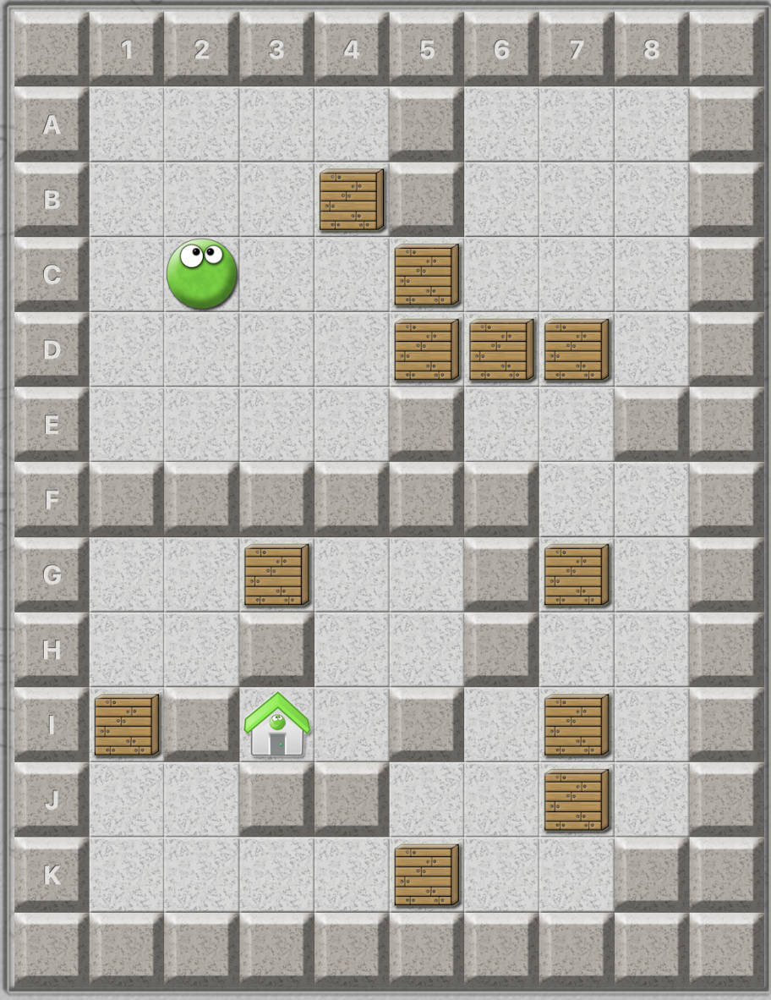

## Florian
box.py erstellen    erledigt
push logik einfügen
## Johanna
offen: Assets finden
Kisten und und und

## Vorläufiger Levelplan
- Level 1 hat keine Schwierigkeiten, erstmal nur Player von Start ins Ziel wie in  
- Level 2 hat erste Boxen, wie in  
- Level 3 hat schon kleinen Kniff drin, Boxen taktisch bewegen, wie in  

## Next steps:
- Level 1 erstmal fertigstellen
- Levelmaps anfertigen, Levelsystem bis Level 3 bauen
- Boxen einführen, B in Levelmap integrieren, Box-Logik erstellen (nur schieben, wenn Platz..)
- Ziel = Nächstes Level öffnet sich coden

## Dinge, die noch zu entscheiden sind:
- Wie viele Level wollen wir erstellen? Lieber 5-8 gute als 15 halbfertige.
- Levelstruktur
- Welche Schwierigkeiten/Hindernisse sind machbar, welche sind zu viel Arbeit
- Assets aussuchen, itch.io oder kenney.nl
- finale Grid-Game Größe, 10x10? Weiß nicht was üblich ist, Pushy ist 10x13 z.B.

## Schwierigkeiten, die wir bewerten müssen (Eher übernächster Schritt)
Wenn du dich einem Thema annehmen willst, zieh es einfach in deine Aufgaben. Ich meine nicht schon das Erstellen der Hindernisse, sondern erstmal nur das bloße bewerten, reinlesen, gucken wie der Code aussehen/eingebaut werden könnte, wie schwer ist es das grafisch darzustellen usw. (Konzept dazu siehe oben unter Spielidee)
- Beamen
- Unsichtbarer Player
- Schalter Logik
- Rutschbewegung (Physics ändern)
- Licht/Dunkel-Effekt
